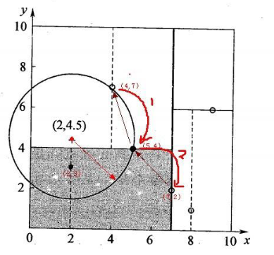
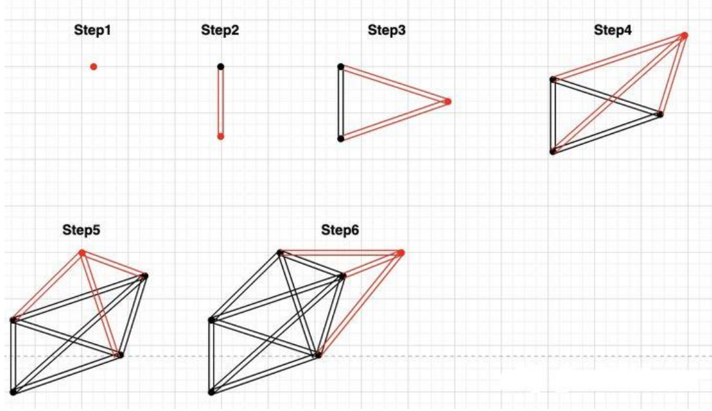
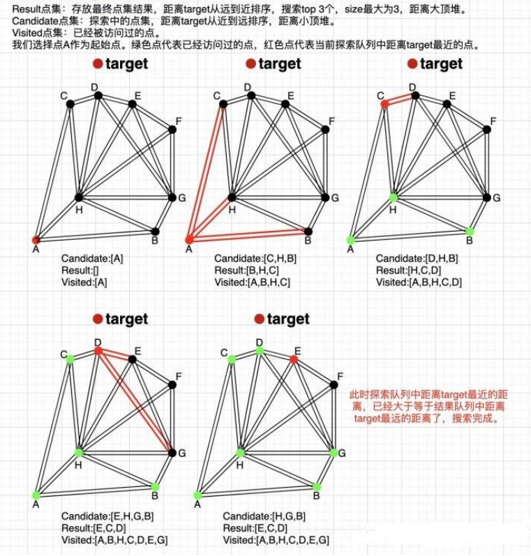
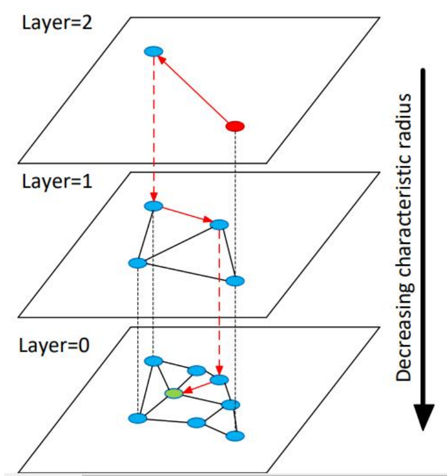
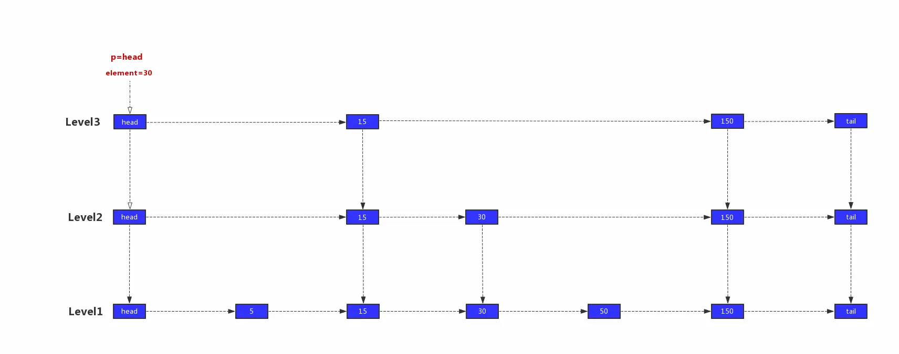

# 1.KNN

## 1.KNN算法

KNN是一种最简单的机器学习算法，所谓的k近邻，就是选用和待预测样本最相近的k样本使用多数表决的方式，来预测该样本的标签值。

### 1.1 KNN三要素

**K值的选择：** 对于K值的选择，一般根据样本分布选择一个较小的值，然后通过交叉验证来选择一个比较合适的最终值；当选择较小的K值，表示使用较小区域中的样本进行预测，训练误差会减小，但是会导致模型变复杂。容易导致过拟合；反之，当选择较大的K值进行预测，可能会导致模型欠拟合。

**距离的度量：** 一般选择欧式距离;在推荐领域中的协同过滤，选择的是余弦相似度。

**决策规则：** 在分类模型中，选用的是多数表决法或者加权多数表决法；在回归模型中，主要使用平均值法或者加权平均值法。
### 1.2 KNN算法的实现

KNN算法的重点在于找出K个最近邻的点，主要方式有以下几种：

**暴力实现(brute):** 计算所有样本到待预测点之间的距离，然后选择距离最小的k个点作为最邻近点。

**KD树（KD-TREE):** KD树算法中，首先是对训练数据进行建模，构建KD树，然后再根据建好的模型来获取邻近样本数据

**选用：** KD树算法中，首先是对训练数据进行建模，构建KD树，然后再根据建好的模型来获取邻近样本数据。

#### 1.2.1 KD树的构建方式

KD树采用从m个样本的n维特征中，分别计算n个特征取值的方差，用方差最大的第k维特征nk作为根节点。对于这个特征，选择取值的中位数nkv作为样本的划分点，对于小于该值的样本划分到左子树，对于大于等于该值的样本划分到右子树，对左右子树采用同样的方式找方差最大的特征作为根节点，递归即可产生KD树。

#### 1.2.2 KD树的查询方式

当我们生成KD树以后，就可以去预测测试集里面的样本目标点了。对于一个目标点，我们首先在KD树里面找到包含目标点的叶子节点。以目标点为圆心，以目标点到叶子节点中样本实例的最短距离为半径，得到一个超球体，最近邻的点一定在这个超球体内部。然后返回叶子节点的父节点，检查另一个子节点包含的超矩形体是否和超球体相交，如果相交就到这个子节点寻找是否有更加近的近邻,有的话就更新最近邻。如果不  
相交那就简单了，我们直接返回父节点的父节点，在另一个子树继续搜索最近邻。当回溯到根节点时，算法结束，此时保存的最近邻节点就是最终的最近邻。  

### 1.3 向量检索相关（Faiss）

在推荐场景中，有时候我们需要牺牲一定的召回准确率来提升向量的召回速度

#### 1.3.1 度量类型和距离

这里只介绍几种常用的距离。

**L2欧式距离**

Faiss中的欧式距离为了提升向量召回速度不计算平方根。

**向量内积**

通常用于推荐系统中的向量召回，但是它不等同于余弦相似度，只有当对所有向量做归一化之后，向量内积才等同于余弦相似度。

**余弦相似度**

Faiss中没有单独计算余弦相似度的方法，Faiss中计算余弦相似度可以将向量归一化后，通过计算向量内积达到 $cov(X,Y)/\sqrt{|X|^2|Y|^2}$ 。也可以将向量归一化后，通过计算欧式距离达到和计算余弦相似度相同的效果 $|X-Y|^2 = 2-2<X,Y>$ 。

同时IndexFlat（暴力检索）还提供了对**METRIC_L1、 METRIC_Linf、METRIC_Lp**的支持。

#### 1.3.2  Faiss中索引的构建

Faiss中索引的构建主要分为三种：利用聚类方法构建索引、利用PCA降维构建索引、利用量化方法构建索引。

常见的算法如下：

**Flat**			暴力检索，召回率最高但是最耗时的一种算法。

**IVFx Flat**		倒排索引+暴力检索，首先将向量矩阵进行聚类操作，得到x个簇，然后每个簇里面进行暴力检索。

**PQx**		利用乘积量化的方法，改进了普通检索，将一个向量的维度切成x段，每段分别进行检索，**每段向量的检索结果取交集后得出最后的TopK**。因此速度很快，而且占用内存较小，召回率也相对较高。

**IVFx PQy**		工业界大量使用此方法，各项指标都均可以接受，利用乘积量化的方法，改进了IVF的k-means，将一个向量的维度切成x段，每段分别进行k-means再检索。

**HNSWx**		基于HNSW算法的图检索方法，召回率基本能够媲美Flat，时间复杂度也很低；并且**支持分批导入、极其适合线上任务**，唯一的缺陷就是内存占用率特别大以及构建索引速度比较慢

#### 1.3.3 HNSW介绍

HNSW(Hierarchical Navigable Small World)即“可导航小世界网络”算法。也就是说世界上任何事物都可以通过间接的途径建立起连接。HNSW具有以下几个特点：

* 任意节点之间均可通过直接或间接方式连接起来，不存在孤立点；
* Short-Range Edge用于连接两个相近的点；
* Long-Range Edge也就是高速公路，主要用于连接两个较远距离的点，可以让其直接相连，而不需要通过多次转换，主要用于加速导航；

* 跳表结构：一种快速查询数据的一种方式；
* HNSW是在NSW的基础上发展过来的(加跳表结构)。

**NSW网络的构建：**

从数据集中读取样本一个样本为一个点地构建。

先给定每个点的连接数（HNSWx的x)，在插入每个样本点的时候，通过计算离该点最近的x个点进行连接（长边的构架在样本的随机构建中已经产生）。

    

**寻找距离target最近的3个点：**
1. **随机选择**一个点A作为初始进入点entry point，建立空的废弃列表visitedSet和动态列表Result（定长为s的列表（s>x）,HSWx的x），将初始点到target的距离计算出来，并放入visitedSet中，同时准备候选节点列表Candidate放入当前计算的节点，并依距离从小到大排序得到Candidate：[A]。
2. 对Candidate中的第一个点找出其“邻居节点”[B,C,H]，查看这些“邻居节点”是否存储在visitedSet中，如果存在，则丢弃，如不存在，将这些**剩余“邻居节点**”计算距离记录在VisitedSet中（以免后续重复查找，走冤枉路），并根据将这些剩余”邻居节点“放入Result依距离从小到大排序，取前s个。
3. 重复第二步操作，直至Result列表不再更新。

    

**跳表结构的理解：**

跳表是一种类似于二分搜索，加速搜索的数据结构，是一种以空间换时间的结构。

**跳表的构建**是从最底层开始第一层将所有数据点导入构建NSW网络，第二层（默认50%概率）将第一层包含的样本点随机插入构建NSW网络，第三层将第二层包含的样本点随机插入构建NSW网络,....，故此跳表具有以下性质：由很多层结构组成；每一层都是一个网络；最底层(Level 1)的链表包含所有元素；如果一个元素出现在 Level i 的链表中，则它在 Level i 之下的链表也都会出现。

    

**跳表的查询：**

跳表的查询时从上到下的查询：

1）`p`​=`head`​，`head.right.value`​=`15`​,`15`​<`30`​,继续往右边查找，`p`​=`head.right`​

2）`p.right.value`​=`150`​，`150`​ > `30`​，往下一层查找,`p`​=`p.down`​

3）`p.right.value`​=`30`​，`30`​=`30`​，继续往右边查找,`p`​=`p.right`​

4）`p.right.value`​=`150`​，`150`​ > `30`​，往下一层查找,`p`​=`p.down`​

5）`p.right.value`​=`50`​，`50`​ > `30`​，由于`p.down`​为空，所以就返回该节点

